## 项目简介

本项目是一个塔防游戏，基于 CS61A 项目作业 [**A**nts **V**s. **S**ome**B**ees](https://cs61a.org/proj/ants)，使用了 C++ 进行重新实现，同时增加了一些新的功能和特性。


因此，Avsb 并没有使用如 Qt 之类的 GUI 框架，而是使用了 Web 前端作为 GUI 的实现。这样做的好处是前后端分离，可以专注于使用 C++ 作为后端的游戏逻辑的实现，而前端部分可以直接复用 CS61A 项目的代码。

当然基础的 Avsb 并不能满足所有的要求，因此为了扩充内容，以及使得前端能与新的后端进行通信，我也对前端的代码进行了一些修改。

## 使用说明

### 内容

游戏已经打包为 `Avsb.zip` 文件，解压到 `Avsb` 目录后有以下文件：
1. `Avsb.exe`：游戏本体文件，支持直接打开或命令行运行
2. `static`：存储游戏所需的静态资源，包括图片、音频等
3. `templates`：存储游戏的 HTML 模板文件

这三个文件夹应该放在同一个目录下，是游戏的运行所需的全部文件，在不明白详细情况下，不应该对这三个文件夹进行修改。

使用过程中可能会产生一个 `config.json` 文件，这个是游戏的配置文件，可以在其中进行游戏的配置，而不需要每次都在命令行中输入相应的参数。

### 命令行

可使用 `-h` 或 `--help` 获取帮助信息，如下：

```
$ ./Avsb.exe -h
Usage: Ants vs. SomeBees [--help] [--version] [[--difficulty DIFFICULTY]|[--plan PLAN]] [--water] [--open] [--food FOOD] [--log LEVEL] [--port PORT] [--config CONFIG] [--save]

Optional arguments:
  -h, --help                   shows help message and exits
  -v, --version                prints version information and exits
  -d, --difficulty DIFFICULTY  sets difficulty of game (test/easy/normal/hard/extra-hard) [default: "normal"]
  -a, --plan PLAN              path to custom assault plan JSON file
  -w, --water                  loads a full layout with water
  -o, --open                   automatically open the game in a browser (maybe not work in your OS!)
  -f, --food FOOD              number of food to start with when testing [default: 2]
  -l, --log LEVEL              sets log level (0:TEST, 1:INFO, 2:ERROR, 3:NONE) [default: 1]
  -p, --port PORT              sets the port for the server [default: 18080]
  -c, --config CONFIG          path to config file [default: "./config.json"]
  -s, --save                   save game configuration to file and exit
```

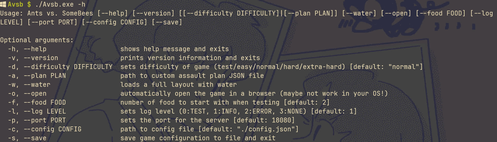

下面对命令行参数进行简要说明：
1. `-h`, `--help`：显示帮助信息
2. `-v`, `--version`：显示版本信息
3. `-d`, `--difficulty`：设置游戏难度，可选值为 `test`、`easy`、`normal`、`hard`、`extra-hard`，默认为 `normal`。难度会影响地图的大小以及敌人的攻击计划等
4. `-a`, `--plan`：设置敌人的攻击计划配置文件路径。与 `-d` 互斥
5. `-w`, `--water`：加载一个带有水的地图
6. `-o`, `--open`：自动在浏览器中打开游戏（可能不适用于所有操作系统）
7. `-f`, `--food`：设置游戏开始时的食物数量，默认为 2
8. `-l`, `--log`：设置日志等级，可选值为 `0`、`1`、`2`、`3`，分别对应 `TEST`、`INFO`、`ERROR`、`NONE`，默认为 `1`。值越高，显示的日志信息越少，`3` 时不显示任何日志信息。显示过多日志，由于终端刷新速度的限制，可能会导致游戏运行速度变慢。此外不显示任何日志信息也非绝对的，有的信息会强制显示
9. `-p`, `--port`：设置服务器的端口号，默认为 `18080`
10. `-c`, `--config`：设置配置文件路径，默认为 `./config.json`。设置优先级是：命令行参数 > 配置文件 > 默认值
11. `-s`, `--save`：保存当前的游戏配置到 `./config.json` 中。可以用这个方便地保存当前的配置

### 运行

可以直接双击 `Avsb.exe` 运行游戏，会弹出一个终端用于显示日志信息。初次运行时可能会遇到防火墙的提示，选择允许即可。

如下图所示，为了演示方便我使用了配置文件进行配置。同时为了呈现更多信息，我将日志等级设置为 `0`，这样可以看到更多的日志信息，实际默认情形，只会有最后一条 INFO 的信息：

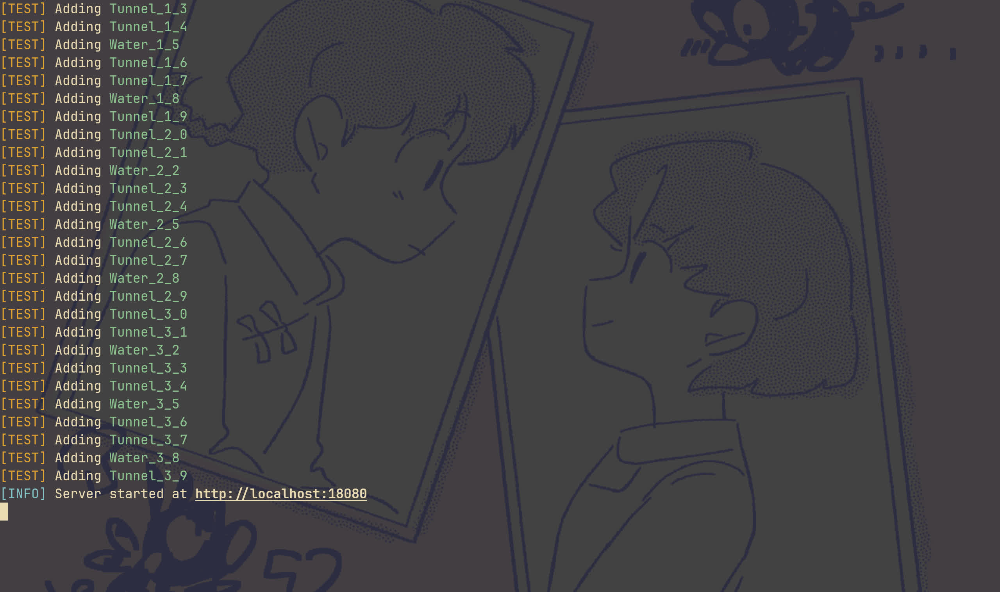

好一点的终端都可以直接点击链接打开游戏，但是有的终端可能不支持，这时候可以手动打开浏览器，输入 `http://localhost:18080`（默认）打开游戏。此外也可以通过 `-o` 参数或将配置文件中的 `autoOpen` 字段设置为 `true` 自动打开游戏。

### 游戏界面

游戏主界面如下图所示：

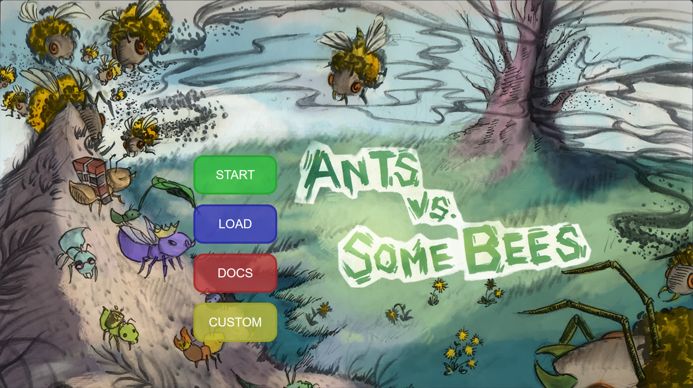

对比 CS61A 的 Avsb 可以看出来，除了 START(开始游戏) 外多了三个按钮，分别是 LOAD(加载存档), DOCS(查看文档) 和 CUSTOM(自定义攻击计划)。

LOAD 和 CUSTOM 暂且按下不表。DOCS 按钮目前会打开 CS61A 的 Avsb 文档，因为我虽然有了代码文档，但是游戏文档还没来得及写，因此游戏的相关信息可以去看 CS61A 的文档（有些部分不同）。

### 游戏操作

点击 START 按钮后，会进入游戏界面，如下图所示：

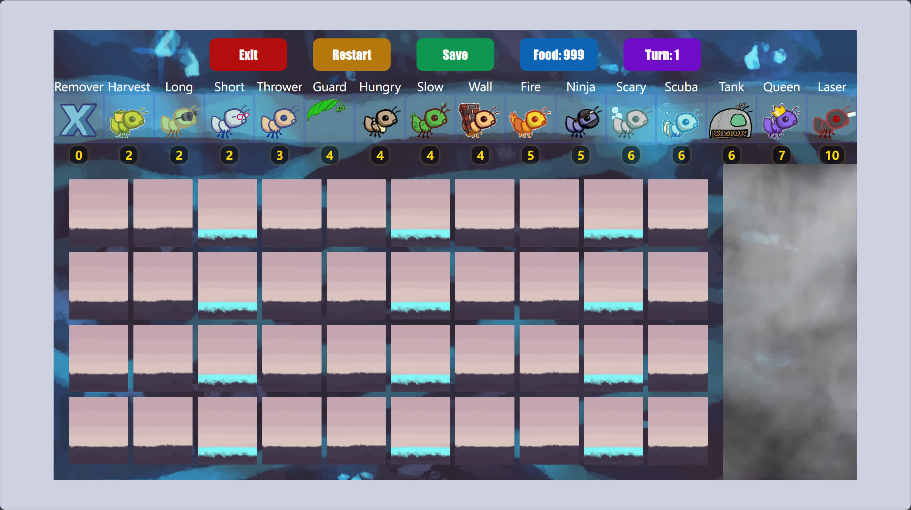

正上方一排是三个按钮 Exit(关闭 GUI 并退出游戏), Restart(刷新重新开始游戏) 和 Save(保存游戏存档)。除了按钮外还有 Food 和 Turn 显示，分别表示当前剩余的食物数量和当前回合数。

再下面一排 16 个 Ant 按钮，对应可选的 16 个 Ant 单位。每个 Ant 单位上面是其名称，下面是其价格。点击对应的 Ant 按钮，然后点击地图上的格子，就可以在对应的格子上放置对应的 Ant 单位，并消耗相应的食物。此外食物不充足时，对应的 Ant 单位会变灰，表示无法生成。

主体部分就是地图，地图上有一些格子。首先就是非常显著的有水格子，这需要特殊的单位才能放置上去，否则放置后会立刻死亡。此外即使都是陆地格子，细心观察也可发现其纹理并不完全相同。

地图右侧是~~战争迷雾~~，进攻的 Bee 会从其中进入地图，当 Bee 到达了地图的最左侧时，就会失败。当放置了 Queen 后，且 Queen 死亡，也会失败。当所有的 Bee 都被消灭时，就会胜利。

按下 <kbd>Space</kbd> 可以暂停或继续游戏。此时无法继续进行操作，但是可以退出、重新开始或保存游戏：

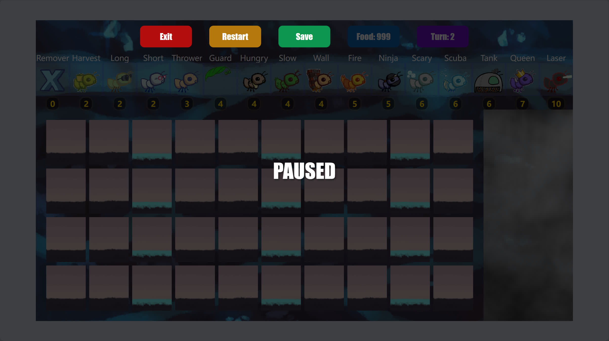

开启 TEST 级日志信息时，会显示很多信息，例如每一回合的所有尚存 Insect 单位都会显示在终端上，同时使用了不同的颜色区分重点：

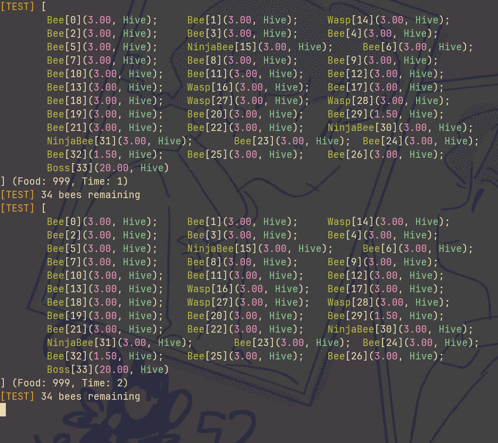

对上面的日志显示进行一个简单的解读：每一个 Insect 单位格式都是 `type[id](health, place)`，其中 `type` 是单位的类型，`id` 是单位的唯一标识符，`health` 是单位的生命值，`place` 是单位的位置。其他不言自明。

下面是 Bee 出现的场景，已经部署了一些 Ant 单位：

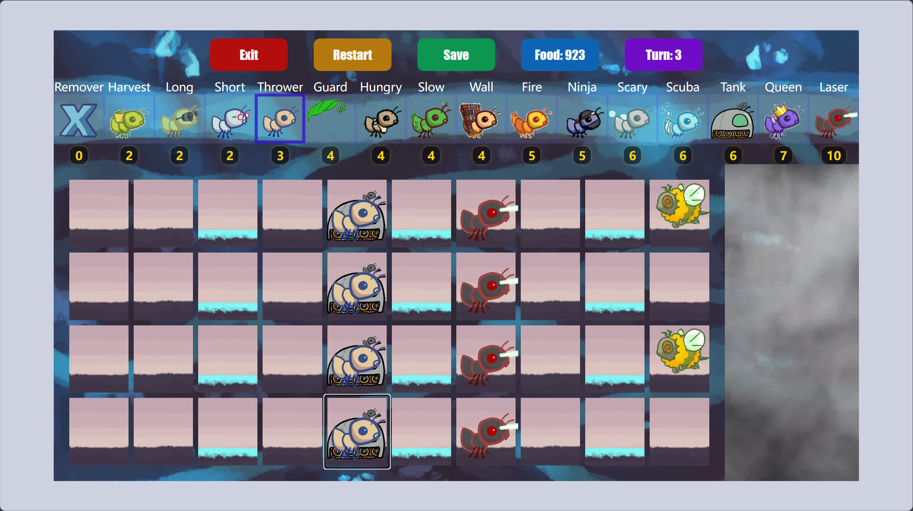

此时也显示了更多日志信息：

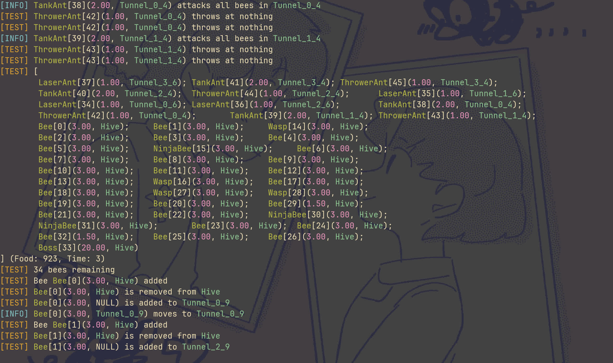

除了 Hive 外，还有两种 Place，分别是 Tunnel 和 Water，代表普通陆地和水地。每个 Place 名称为 `place_x_y`，其中 `x` 和 `y` 分别是地图上的横纵坐标（从 0 开始，以左上角为原点）。

点击 Save 后会自动保存存档文件，如下图所示：

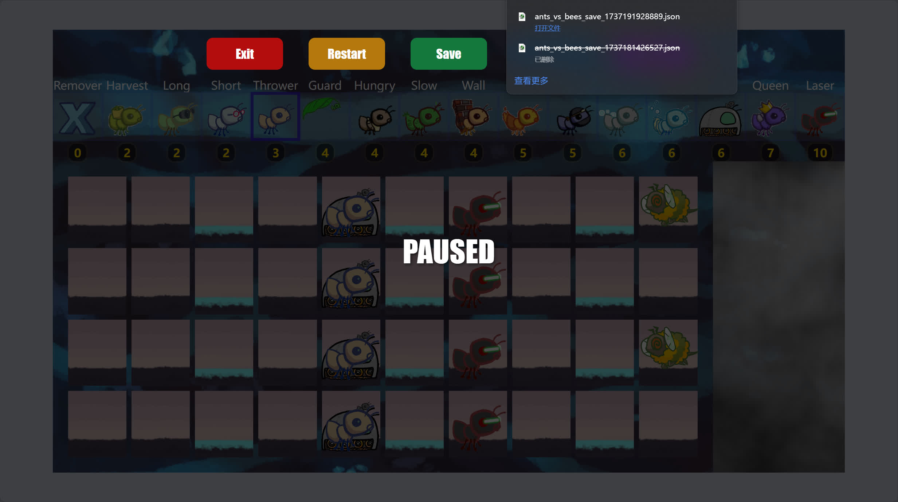

存档的修改、自定义进攻计划的编写、手动调整回合等高级配置内容，放到最后再行解释，先进入自我评分环节。

## 基础功能

### 游戏逻辑

#### 游戏场景

> （10/10 分）搭建出可供角色或单位活动的场景，能够实现角色或单位的管理和流畅的游戏循环。

上面短短的演示已经足以说明了。

#### 角色或单位

> （10/10 分）包括玩家角色、敌人单位等，或设施设备等游戏基础的交互单位，角色或单位完成一个封顶 3 分，两个封顶 6 分，三个及以上封顶 10 分。计算在内的角色和单位应具有一定复杂度（例如移动、交互、操纵能力）。若选择的游戏类型中，角色或单位逻辑和功能实现较为复杂，可适当减少角色或单位数量，但需要说明和体现其复杂度，此时助教会根据复杂度和数量综合评分，封顶 10 分。

我方单位一共有 16 种，敌方单位一共有 4 种，地面单位一共有 2 种。同时复杂性也够了，各种单位的各种特性可以参考上面给出的 CS61A 的 Avsb 文档，或者我有时间再写一个详细的文档。

### 交互界面

#### 完整界面

> （15/15 分）搭建完整的用户交互界面。用户可以通过游戏界面进行开始游戏、读取存档、操纵角色等操作。评分会考虑界面的完整度、美观度，以及用户操作界面设计的合理性。

上面的演示已经足以说明了，可以「开始游戏」「读取存档」「操纵角色」等操作。

同时对于「完整度」「美观度」「合理性」，我相信 CS61A 课程，也相信我的审美与体验。

#### 交互方式

> （5/5 分）设计合理的用户操作方式，包括但不限于鼠标、键盘等。

支持使用鼠标进行大部分操作，使用键盘进行暂停等操作。

#### 操作反馈

> （5/5 分）用户进行操作后，游戏界面能够给予用户明确的反馈，例如角色动作、提示、音效等。

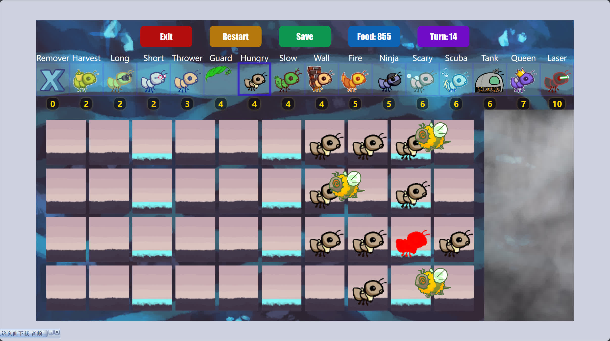

受到伤害会有红色的闪烁效果。

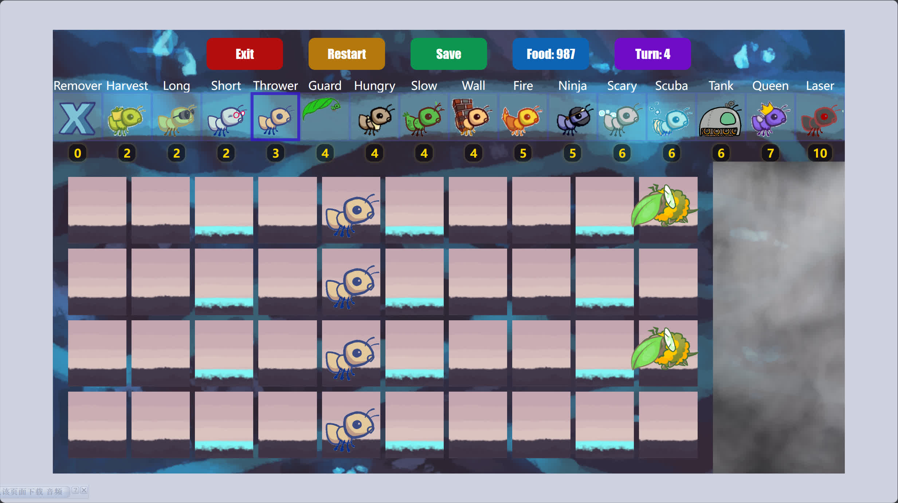

对于 Thrower 类型的单位，可以看到其丢 Leaf 的过程等等。

### 其他功能

#### 存档功能

> （10/10 分）游戏可以进行存档。在关闭游戏后再次打开，需要能够从存档点继续游戏，可得 5 分。从外部可修改存档文件，读档后能够调整游戏进度，可得 5 分。

上面已经演示了存档功能，存档是 JSON 格式，可以直接修改，如下图所示：

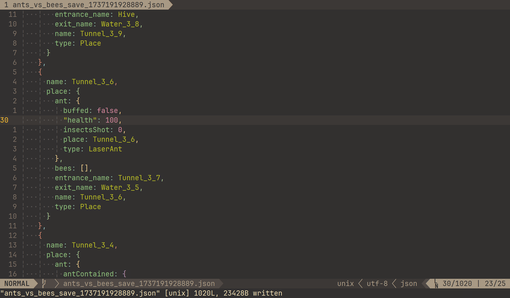

Laser 的生命初始就是 1，我改成了 100，然后可以在主界面通过 LOAD 按钮加载存档。游戏主界面可能无法看出什么，日志如下图所示：

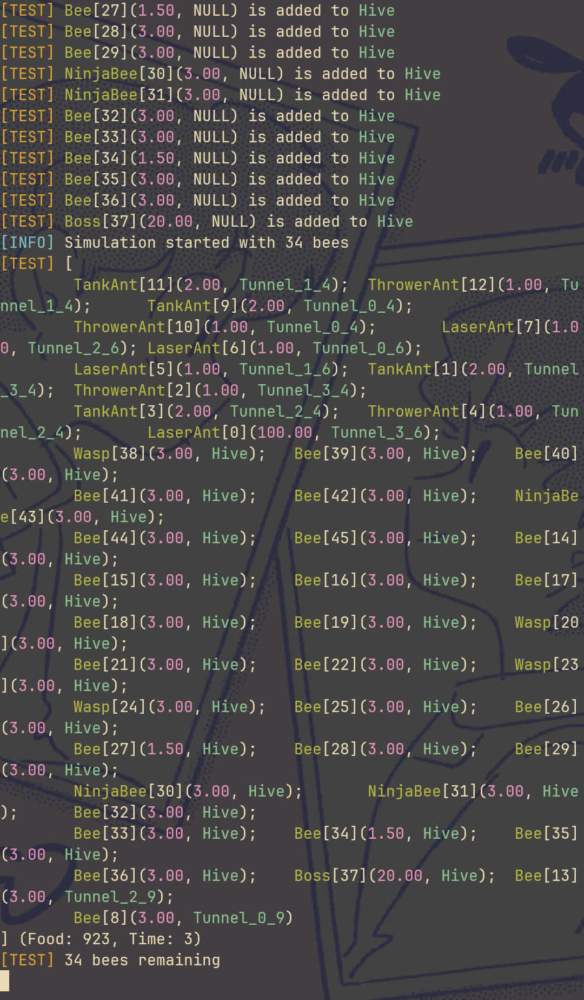

可以看出 Tunnel_3_6 上的 Laser 生命值确实已经变成了 100。

#### 商店和强化系统

> （10/10 分）游戏有一定的数值设计和升级机制，玩家可以通过游戏中的商店购买道具或强化角色、单位等。实现一种单位或角色的强化机制封顶 5 分，实现两种及以上封顶 10 分。

一共 16 种 Ant 单位的继承关系如下图所示：

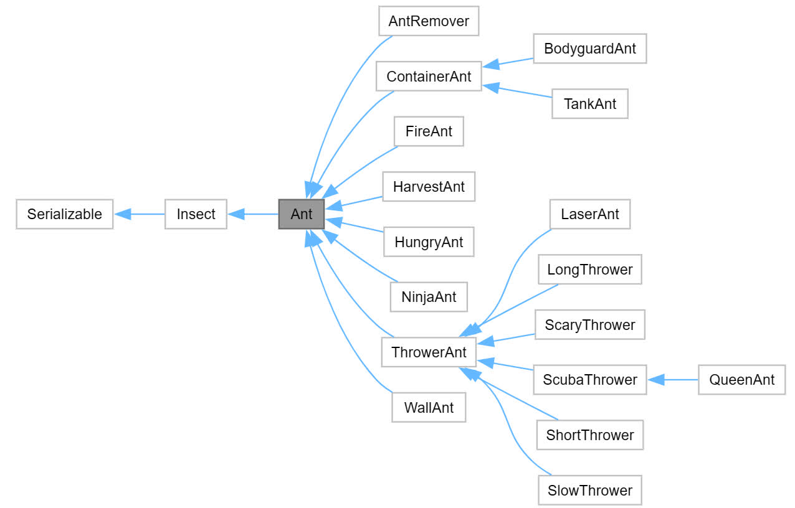

可以看到实现了多种强化机制。例如 Tank 除了容纳其他 Ant 外，还能攻击 Bee；Laser 变态级别的敌我不分；Scary 和 Slow 面对 500 生命值的人工变态 Boss 的强力辅助；Scuba 水上生存能力；Queen 的激励等等。

更复杂的各种机制，例如 Hungry, Fire 等，因为没有后续继承，而且时间原因，就不详细展开了，

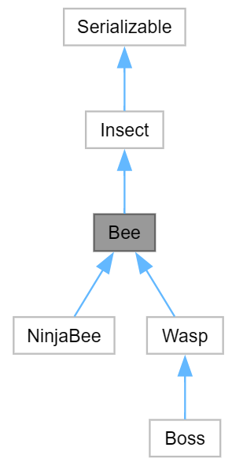

Bee 也有多种类型，除了基础的 Bee 外，还有无视阻拦的 NinjaBee，更高伤害的 Wasp，拥有攻击修正的 Boss（是唯一一个 Hungry 无法瞬杀的单位）。

## 代码管理

### Git 提交规范

> （10/10 分）若只有一次提交记录，或一次性提交绝大多数主体代码，不得此部分分。多次提交且合理，封顶 10 分。

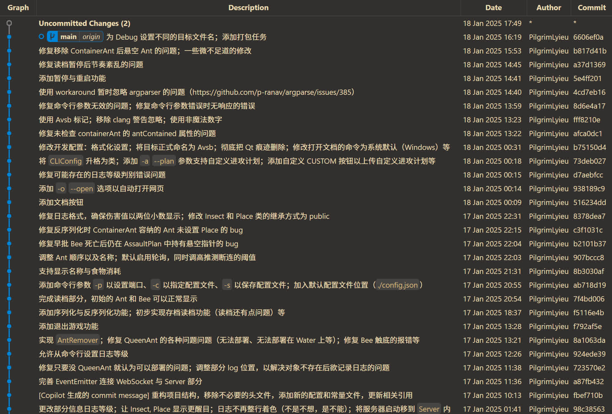

截至目前我在写这个演示，已经有了 79 次提交，后续可能会继续修复 bug，添加文档等等。基本上每次提交的提交信息都是有意义的。

### C++ 面向对象特性

> （5/5 分）合理运用如封装、继承、多态等面向对象特性，封顶 5 分。

问我 C++ 面向对象特性具体是啥我也记不清了，但是我想这 5 分应该还是轻而易举的，下面是所有的继承关系：

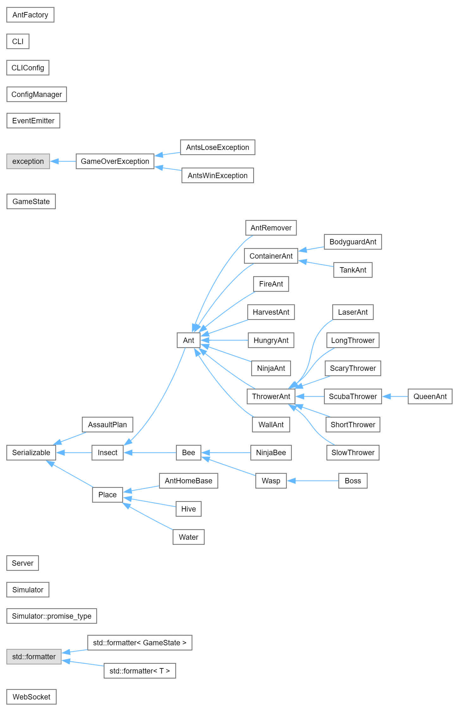

有关封装和多态，可以部分参考下面的代码：

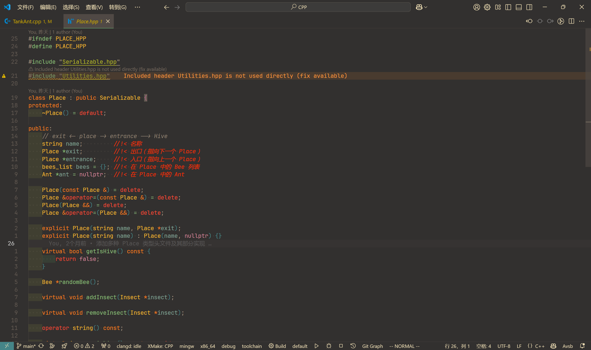

除此以外还使用了很多 C++ 新版本的特性，如 C++20 的 `format`、协程、concept 等等。

### 多文件编程

> （5/5 分）合理拆分代码文件，代码注释清晰、变量名表意明确等，封顶 5 分。

```
 Avsb
├──  .vscode
│   ├──  c_cpp_properties.json
│   ├──  compile_commands.json
│   ├──  extensions.json
│   ├──  launch.json
│   ├──  settings.json
│   └──  tasks.json
├──  .xmake
│   ├──  windows
│   └──  vscode-build.log
├──  build
│   ├──  .build_cache
│   ├──  .deps
│   ├──  .objs
│   ├──  static
│   ├──  templates
│   ├──  Avsb.exe
│   ├──  Avsb.zip
│   ├──  AvsbDebug.exe
│   ├──  libAvsbLib.a
│   └──  libAvsbLibDebug.a
├──  dependencies
│   ├──  asio
│   ├──  crow
│   ├──  asio.hpp
│   └──  crow.h
├──  doc
│   ├──  html
├──  include
│   ├──  Ants
│   ├──  Bees
│   ├──  Exceptions
│   ├──  GUI
│   ├──  Places
│   ├──  Plans
│   ├──  Project
│   ├──  CLI.hpp
│   ├──  GameState.hpp
│   ├──  Insect.hpp
│   ├──  Serializable.hpp
│   └──  Utilities.hpp
├──  material
│   ├──  2024智软高程课程项目要求与评分细则.pdf
│   └──  塔防游戏说明文档.pdf
├──  src
│   ├──  Ants
│   ├──  Bees
│   ├──  GUI
│   ├──  Places
│   ├──  Plans
│   ├──  CLI.cpp
│   ├──  GameState.cpp
│   ├──  Insect.cpp
│   ├──  Main.cpp
│   └──  Utilities.cpp
├──  static
│   ├──  assets
│   ├──  script.js
│   ├──  style.css
│   └──  utility.js
├──  templates
│   └──  index.html
├──  test
│   ├──  advance
│   └──  basic
├──  .clang-format
├──  .clang-tidy
├──  .clangd
├──  .gitignore
├──  Doxyfile
├── 󰂺 README.md
└──  xmake.lua
```

这个是项目的目录结构，展开两层，因此更深层的代码并没有显示在上面。

## 选做内容

### 玩家游戏体验

> （5/5 分）游戏难度适中，游戏界面设计合乎用户操作逻辑，游戏过程中有一定的引导和提示，游玩体验较好，封顶 5 分。

首先是依旧相信 CS61A 课程的水平。然后是游戏难度充分可调节，不仅有基础调节，还有进阶调整等。界面设置也符合用户操作逻辑，游戏过程中有一定的引导和提示，例如放置 Ant 单位时会有提示，游戏过程中会有日志信息等等。综上游玩体验较好。

### 酷炫 GUI

> （5/5 分）游戏界面设计美观，有一定的动态效果，界面元素设计合理，考虑不同大小屏幕的适配等，封顶 5 分。

相信 CS61A 课程的水平与我的审美。Ant 和 Bee 单位都是动态的，而且像上面呈现的那样，有攻击与投掷的动效。界面元素设置合理，同时因为是 Web 界面，所以适配性也很好。

### 背景音乐

> （5/5 分）游戏有背景音乐，且与游戏内容相符，封顶 5 分。

背景音乐不错，已经听出 PTSD 了。
